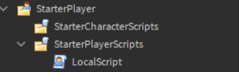

# On Join Message

Step 1: Download the file and copy the local script into your game.


 You must make sure it's a local script otherwise it will not work.


Step 2: Once you have completed step 1 drag it into Starterplayer &gt; StarterPlayerScripts

Step 3: Open up the Local Script and edit the text in the quotation marks which are on line 3

Step 4: You can now publish your game and go test it out. If it does not work make sure you followed the guide, if it still does not work please open a ticket and our support team will be happy to help.

